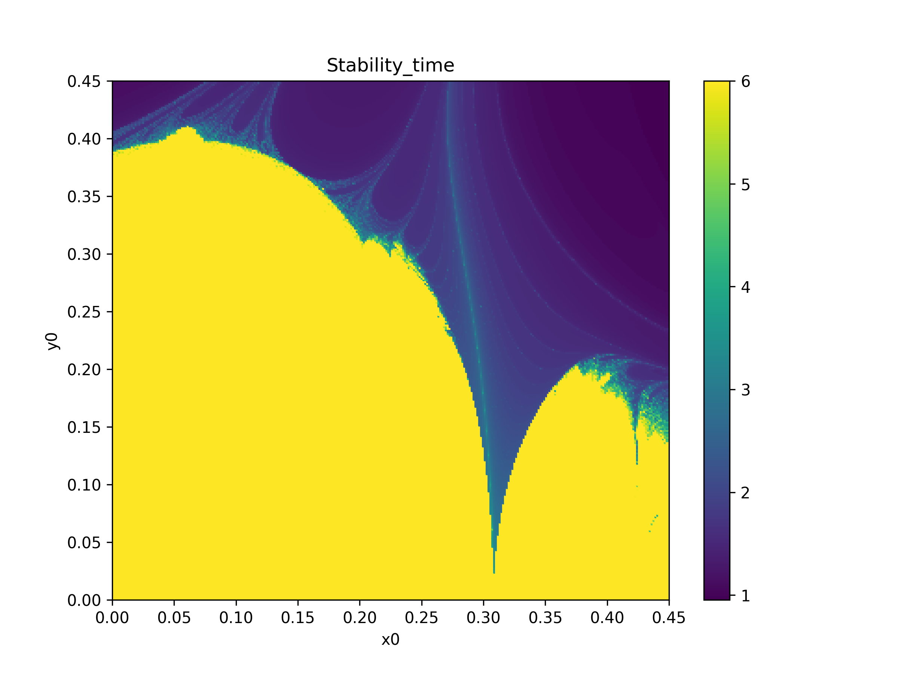

# Betatron Motion for Software and Computing for Nuclear and Subnuclear Physics exam
This repository contains two main codes developed in C and other python scripts to extract plots and further analysis. I start describing the 2D map and then the 4D map. **If you need more details about the theoretical background of this project, please read the report in the repository**.
## Description of the 2D Hénon map
The first one, `2DHenonMap.c`, calculates the 2D Hénon map, which is a symplectic map generally used in accelerator physics to model the transverse motion of a particle in a circular accelerator.  
The aim is to study the orbital stability of a particle and distinguish between initial conditions that lead to chaos and ones that remain stable after the total number of turns.
To compile the code, use the following command:
```bash
gcc 2DHenonMap.c -o 2dmap
```
To run:
```bash
./2dmap nu eps N_steps N_iterations
```
For example you may use:
```bash
./2dmap 0.21 0 200 200
```
The command line parameters represent: "**tune modulation N_steps N_iterations**".   

- '**Tune**': (nu in the code) Represents the oscillation frequency in the transverse plane. Its definition is: Q= 2π/ω. The number of islands that you can obseve in the phase-space portrait depends on its value.  
  Examples are shown with: Q= 0.21 and Q= 0.254 because the first one is close to 1/5 and the second one is close to 1/4.   Indeed performing simulations you will obtain respectively 5 and 4 islands. These islands are stability regions, meaning that a particle with a set of initial conditions inside them will not become chaotic.
- '**Modulation**': (eps in the code) Takes into account the coupling between betatron and synchrotron motion and power supply ripples.
- '**N_steps**': The number of steps to explore the lattice of initial conditions built in the code (suggested value: 200 to obtain my results, in this way the code will do 400 steps from -200 to 200, resulting in a 400x400 lattice). **In this code the lattice goes from -1 to +1 whatever value you choose for N_steps**, the higher N_steps the more precise the lattice will be. 
- '**N_iterations**': The number of map iterations to compute the dynamical indicator Lyapunov Error (suggested value: 200).
  Furthermore the code performs the tracking (1000 turns) for a small number of initial conditions to extract the phase-space portrait.  
  From this code you obtain two **.txt** files, one containing the tracking and the other one the value of Lyapunov error. The first file is divided into two columns that represent the evolution of the initial conditions. The second file is divided into three columns, the first two represent the initial conditions on x and p while the third one is the computed value for the Lyapunov error. **To save CPU you can use the data I extracted from this simulation that you find in the repository "2DHénonMap_data_plots"**
  
In particular you can reproduce the plots shown below using the python script `HenonPlots2D.py` that can be executed using:
```bash
./HenonPlots2D.py tracking_file.txt lyapunov_error.txt
```
For instance you can do:
```bash
./HenonPlots2D.py tracking_nu0.21_eps0.txt lyapunov_error2D_nu0.21__eps0_200.txt
```
obtaining:

 <div style="display: flex; flex-direction: row;">
  
  
</div>

In the report, you find a larger explanation of what is shown here. The non-modulated plots have the same features, but with Lyapunov error we can distinguish the stability islands (blue regions) also when we have a large modulation:
<div style="display: flex; flex-direction: row;">
  
  
</div>
These two plots were obtained using: tracking_nu0.254_eps64.txt, lyapunov_error2D_nu0.254__eps64_200.txt.     

## Description of the 4D Hénon map
The second part of this project is based on `4DHenonMap.c` and `stabilitytime.c`. The first code is a generalization of the previous case to the 4-dimensions: x, px, y, py with the addition of another dynamical indicator named Reversibility Error Method (REM). The second code allows to compute the stability time.   In principle, one is interested into knowing the fate of a particle with given initial conditions in the phase-space after a large number of turns. This is a major problem to assess to design properly the beam pipe, in fact oscillations and non-linearities in the transverse plane can lead to a growth in the space coordinates that overcome the width of the pipe. One may think to follow the particle through its journey up to a very large number of turns, for each possible initial condition.   This is a rather long process, for this reason dynamical indicators, borrowed from celestial mechanics, have been implemented to provide an efficient way to study orbital stability.  The stability time which is based on the fact that, given an initial condition, when the number of iterations is n = nmax, if its distance from the origin is smaller than a control parameter r_c, we can consider it as stable. If, instead, the condition is not satisfied we can consider the initial condition as lost and its tracking is stopped.   For the simulation it was used r_c = 10^2, but the dependence of the results on the chosen value for r_c is so small that it can be neglected.  
To compile the first code, you have to use:
```bash
gcc 4DHenonMap.c -o 4dmap
```
and then for example to run the code you may use:
```bash
./4dmap 0.28 0.31 0 300 0.45 10000
```
List of line argument parameters: the tune along x, the tune along y, the modulation, the steps to explore the lattice, the length of the lattice and the number of iterations. 
For the second code, to compile:
```bash
gcc stabilitytime.c -o stabtime
```
and to run:
```bash
./stabtime 0.28 0.31 0 300 0.45 1000000
```
These codes will allow to extract data (N.B output files are organized into three columns "x0", "y0" and "indicator/stabtime") that you can use in the python script `HenonPlots4D.py`. This script can be executed in this way:
```bash
./HenonPlots4D.py lyapunov_file.txt reversibility_file.txt stability_time.txt
```
For example you can try:
```bash
./HenonPlots4D.py lyapunov_nux0.28_nuy0.31_eps0_n10000.txt reversibility_nux0.28_nuy0.31_eps0_n10000.txt stabtime1000000.txt
```
and you will obtain:
  <div style="display: flex; flex-direction: row;">
  
  
  
</div>

## Further analyses 4D Hénon Map
With `HenonPlots4D.py` it is possible to compute the number of stable samples for LE, REM and stability time.   The case of stability time is different from the other two cases because the stable samples correspond to the maximum value of the stability time meaning that orbits have not exceeded the threshold radius r_c. For a number of iterations equal to 10^6, I have obtained 56044 stable samples. Indicators instead provide the number of stable samples eliminating the values equal to nan or ±∞ due to numerical saturation.    
Below the result of the analysis:


Varying the number of iterations shown in the x-axis, the number of stable samples obtained for LE and REM are shown. Already at 10^4 iterations there is a good agreement with the stability time case at 10^6. The number of stable samples was normalized to the one obtained with the stability time. The duration of running with the indicators is extremely lower. Stable samples(LE) = 56643 and Stable samples(REM) = 56668.  

Using `4DHenonMap.c` separating the computation of LE and REM it is possible to perform a time-performance comparison. Below the time performance is plotted as a function of the number of iterations. Blue line for LE and red line for REM.


  Also between the Lyapunov Error and Reversibility error Method there is a difference in terms of time-performance especially when the number of iterations increases.
This analysis is very important because shows that the definition of chaoticity given by the REM and the one given by LE can be considered equivalent. As better explained in the report the Lyapunov error is generally taken as a ground truth for the definition of chaoticity since it considers the different evolution of two nearby initial conditions, but the implementation of REM is much simpler and efficient since it does not require the evolution of the tangent vector in the 4-dimensional hyper-space. Indeed REM requires only the forward and the backward evolution of the Hénon Map.

## Contacts

To get in touch with me write an email to marta.razza@studio.unibo.it


